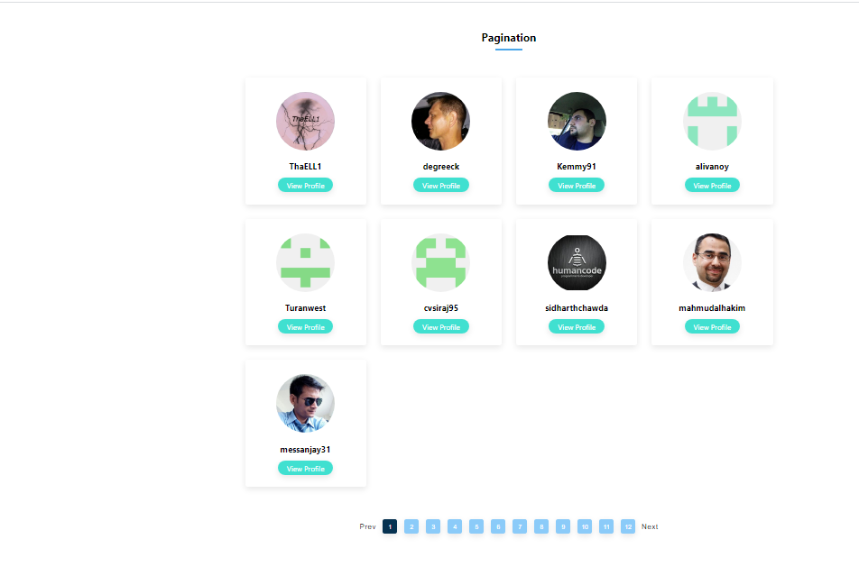
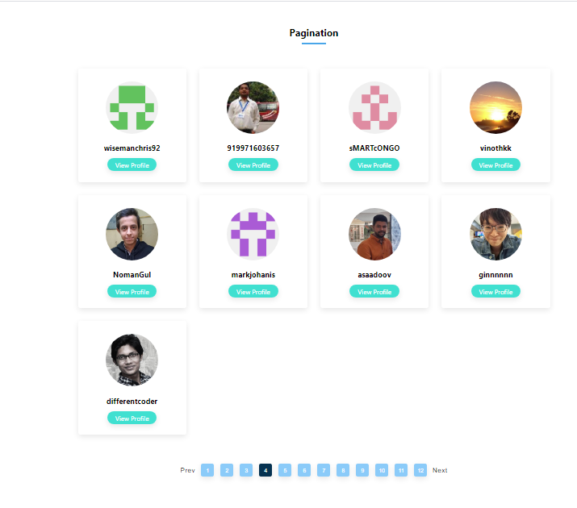
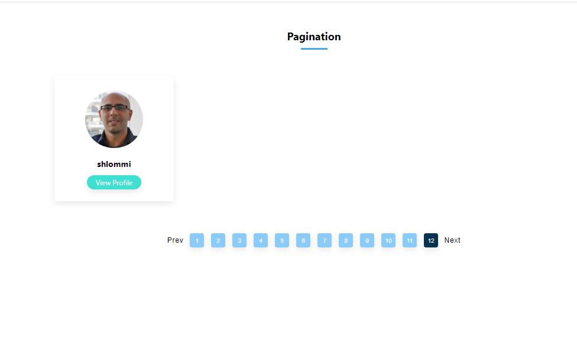
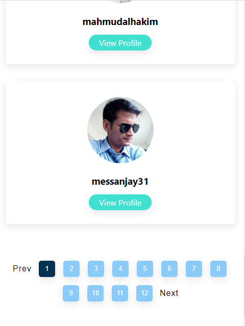

# Pagination

Completed another react project, Pagination is a minor react project in which the 
data fetched from an API call is rendered to the browser in a page format, that is 
the data is divided into different pages and each page is render separatly when user 
clicked on the page number. the picture below shows what is being render to the browser

# Desktop View 

 

 

 

# Mobile View 

 

 